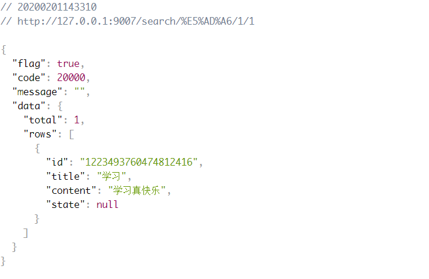
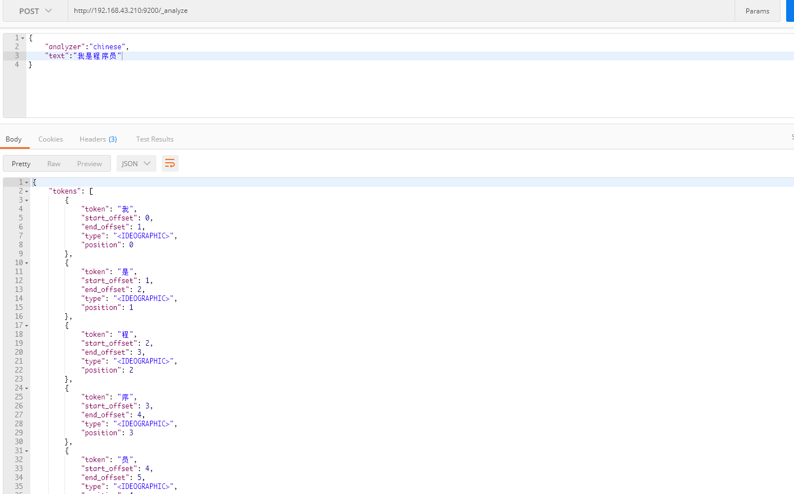
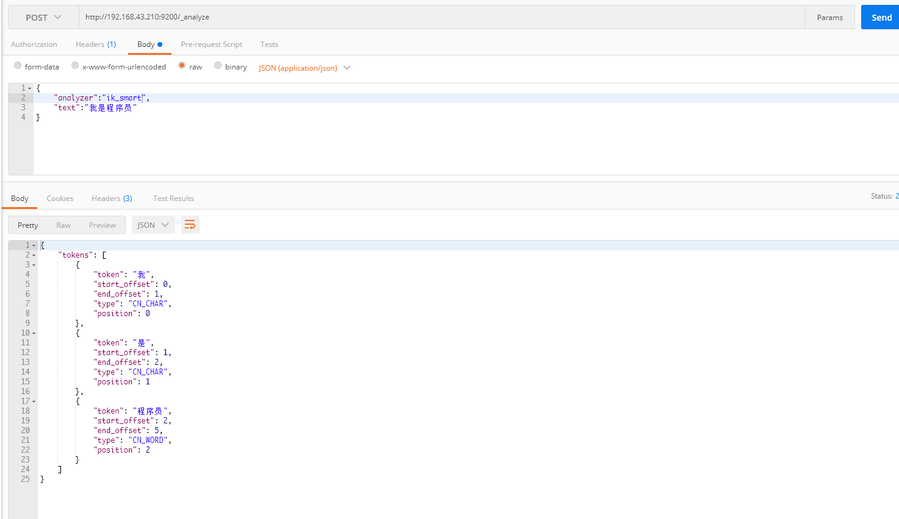

~~~powershell
docker pull daocloud.io/library/elasticsearch:6.6.2
~~~

```powershell
docker run -di --name=tensquare_elasticsearch -p 9200:9200 -p 9300:9300 daocloud.io/library/elasticsearch:6.6.2
```

> 如果启动报错:( **max virtual memory areas vm.max_map_count [65530] likely too low, increase to at least [262144]** )
>
> ~~~powershell
> vim /etc/sysctl.conf
> vm.max_map_count=655360
> sysctl ‐p
> #然后重新启动容器
> ~~~
浏览器输入地址：http://ip:9200/ 即可看到如下信息,即成功了。
.jpg)
 
 
> 访问：http://127.0.0.1:9007/search/学/1/1 可以看到一下结果就🆗了

----
> 在postman中请求的结果可以看到对于中文是单给分词的，这显然是不符合要求的，所以我们需要安装中文分词器来解决这个问题


[ik分词器下载地址](https://github.com/medcl/elasticsearch-analysis-ik/releases) :下载对应的版本

> 将ik分词器解压后传入服务器
>~~~shell script
># 拷贝解压包到elasticsearch容器的plugins目录下
>docker cp elasticsearch-analysis-ik-6.6.2/ tensquare_elasticsearch:/usr/share/elasticsearch/plugins/
>~~~
----
> 重启容器
> ~~~shell script
>  docker restart tensquare_elasticsearch
>  ~~~
---
###测试分词器效果



 


 
